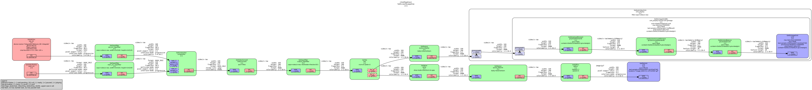

# hello-world-gstreamer

This is a proof of concept for a GStreamer app using Python.


## Motivation

- Learn how to use GStreamer with Python, not only with C++ as I’ve been doing
- Create a silly animated GIF for [my website](https://dkprog.com/) 🙂

## What it does

- The app takes two video sources — your webcam and a test video — and merges them into a single video using `compositor`
- The `compositor` output is then split into two branches using a `tee`. The first branch shows a live preview using `autovideosink`
- The second branch turns the video into a GIF using the [`gifenc`](https://gitlab.freedesktop.org/gstreamer/gst-plugins-rs/-/tree/main/video/gif?ref_type=heads) element from the [`gst-plugins-rs`](https://gitlab.freedesktop.org/gstreamer/gst-plugins-rs) project, saving the GIF to a timestamped file.
- Every `GIF_DURATION_SECONDS=5`, the app stops writing to the current GIF through `valve[drop=True]`, starts a new timestamped file, and keeps the preview branch (`autovideosink`) uninterrupted — a manual rotation that’s necessary because `splitmuxsink` doesn’t work with `gifenc` 🙁



## Quick start

### Install dependencies

Tested on Ubuntu 24.04.3 LTS.

```
sudo apt install python3-gi python3-pytest python3-freezegun gir1.2-gstreamer-1.0 gstreamer1.0-tools gstreamer1.0-plugins-good gstreamer1.0-plugins-bad libssl-dev libglib2.0-dev pkg-config build-essential libgstreamer1.0-dev libgstreamer-plugins-base1.0-dev
```

### Install Rust and cargo-c

Required to compile `gifenc`.

```
curl --proto '=https' --tlsv1.2 -sSf https://sh.rustup.rs | sh -s -- -y
cargo install cargo-c
```

### Build gifenc from gst-plugins-rs

```
export GST_RS_VERSION=gstreamer-1.27.2

git clone --branch $GST_RS_VERSION --depth 1 \
    https://gitlab.freedesktop.org/gstreamer/gst-plugins-rs.git ./gst-plugins-rs
cd ./gst-plugins-rs
cargo cbuild -p gst-plugin-gif
```

Install globally:

```
cargo cinstall -p gst-plugin-cdg --prefix=/usr
```

Or just make `gifenc` available for the current session:

```
export GST_PLUGIN_PATH="path-of-gst-plugins-rs/target/x86_64-unknown-linux-gnu/release:$GST_PLUGIN_PATH"
```

Test the element:

```
gst-inspect-1.0 gifenc
```

### Run the application

```
python src/main.py
```

### Stop the recording

```
Ctrl+C in the terminal window
```

### Test the application

```
pip3 install --break-system-packages pytest==8.4.2 freezegun==1.5.5
pytest .
```
